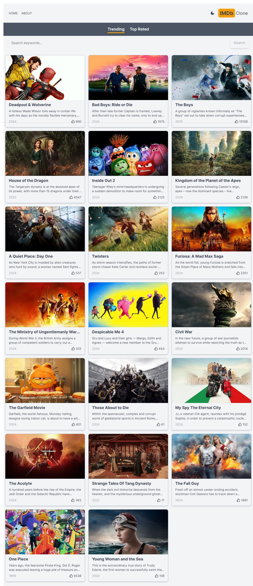

<a name="readme-top"></a>

[my linkedIn][linkedin-url]

<br />
<div align="center">
  <h3 align="center">Movie Information App</h3>

  <p align="center">
    Get Started with Our Movie Information App: Simple CRUD Operations, with More Features Coming Soon.
    <br />
  </p>
</div>

<!-- TABLE OF CONTENTS -->
<details>
  <summary>Table of Contents</summary>
  <ol>
    <li>
      <a href="#about-the-project">About The Project</a>
      <a href="#built-with">Built With</a>\
    </li>
    <li>
      <a href="#getting-started">Getting Started</a>
      <ul>
        <li><a href="#prerequisites">Prerequisites</a></li>
        <li><a href="#installation">Installation</a></li>
      </ul>
    </li>
    <li><a href="#usage">Usage</a></li>
  </ol>
</details>

<!-- ABOUT THE PROJECT -->
## About The Project



Welcome to our Movie Information App, a straightforward platform designed to help you manage your movie collection with ease. Currently, our React-based app supports basic CRUD operations—create, read, update, and delete—allowing you to organize your movies efficiently. While our current focus is on providing a robust foundation, we are committed to enhancing and expanding the app with more features in the future. Join us on this journey as we continue to improve and enrich your movie management experience.

<p align="right">(<a href="#readme-top">back to top</a>)</p>


### Built With

This section should list any major frameworks/libraries used to bootstrap your project. Here are a few examples.

* [Next.js][Next-url]

<p align="right">(<a href="#readme-top">back to top</a>)</p>

<!-- GETTING STARTED -->
## Getting Started

This is an example of how you may give instructions on setting up your project locally.
To get a local copy up and running follow these simple example steps.

### Prerequisites

This is an example of how to list things you need to use the software and how to install them.
* npm
  ```sh
  npm install npm@latest -g
  ```

### Installation

_Below is an example of how you can instruct your audience on installing and setting up your app. This template doesn't rely on any external dependencies or services._

1. Clone the repo
   ```sh
   git clone https://github.com/muhammadderic/movie-information-app.git
   ```
2. Install NPM packages
   ```sh
   npm install
   ```
<p align="right">(<a href="#readme-top">back to top</a>)</p>

<!-- USAGE EXAMPLES -->
## Usage

The client will run in your browser with URL "http://localhost:3000", and

<p align="right">(<a href="#readme-top">back to top</a>)</p>

<!-- MARKDOWN LINKS & IMAGES -->
[linkedin-url]: https://linkedin.com/in/muhammad-donny-ericson
[Next-url]: https://nextjs.org/